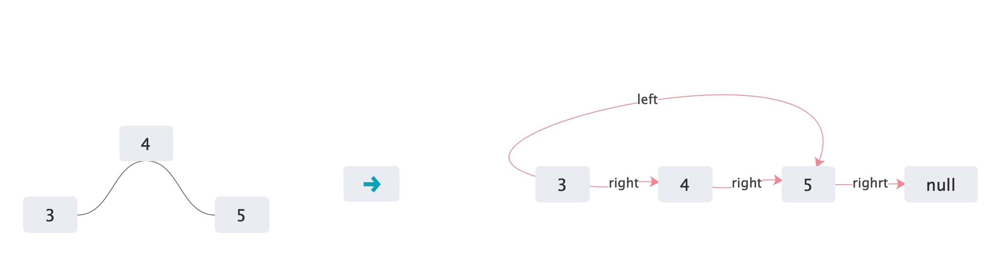

# 114. Flatten Binary Tree to Linked List
+ Given a binary tree, flatten it to a linked list in-place.For example, given the following tree:

```
    1
   / \
  2   5
 / \   \
3   4   6
```
The flattened tree should look like:

```
1
 \
  2
   \
    3
     \
      4
       \
        5
         \
          6

```

+ 思路分析  
	+ 做这道题之前，一定要做过二叉搜索树转成双向链表的那道题，不然不太容易理解本文的思路，下面开始分析题目。题目要求将一个二叉树转成单向链表，也就是将所有节点使用right指针连接起来，所有节点的left指针都置为空。单向链表的顺序是树前序遍历的结果。
	+ 刚拿到这个题目，第一想法是使用一个ArrayList，模拟前序遍历的过程，把每一个节点都放到ArrayList里面，遍历结束之后把他们连接起来，这样额外空间复杂度就是O(n),并不符合题目要求。
	+ 于是，换个思路，在之前有了二叉搜索树转双向链表的经历，那么，我们也可以模仿，调整这棵树的节点。
	+ 在二叉搜索树转双向链表的题中，首先调整左子树，然后调整右子树，然后把他们串起来，具体调整过程如下：

	+ 理解了这个调整逻辑，那么本题的调整逻辑就非常类似了：

+ 代码分析
	+ 有了之前的基础，那么写出如下的代码就不难了

```
    public TreeNode partion(TreeNode root){
        if(root.left==null&&root.right==null){ // 左右子树均为空
            root.left=root;
            return root;
        }
        if(root.right==null){ // 右子树为空，左子树一定不空
            TreeNode left=partion(root.left);
            root.right=left;
            root.left=left.left;
            left.left=null;
            return root;
        }
        if (root.left == null) {
            TreeNode right=partion(root.right);
            root.right=right;
            root.left=right.left;
            right.left=null;
            return root;
        }
        TreeNode left=partion(root.left);  // 先递归调整左子树
        TreeNode right=partion(root.right);
// 从下面开始要注意，虽然题目要求是前序遍历的结果，这里都是先序遍
历左右子树，然后再调整根节点，有点类似后序遍历，会不会有问题呢。实
际上，遍历的顺序不重要，重要的是怎么调整的，当左右子树均不为空时，
先调整左右子树，然后把左子树跟右子树连接起来，最后把根节点挂到左子
树前边，就成了”根左右“的顺序，会发现调整后正好是前序遍历的结果。
        root.right=left;
        left.left.right=right;
        left.left=null;
        root.left=right.left;
        right.left=null;
        return root;
    }
    public void flatten(TreeNode root) {
        if(root==null)
            return;
        root=partion(root);
        root.left=null;
    }

```
+ 算法分析
	+ 时间复杂度  
	时间复杂度为O(n)，因为每有一个节点，就需要递归调整一次
	+ 空间复杂度
	空间复杂度并不是绝对的O(1),因为我是递归调整，因此当某一个节点的左右子树均不为空时，其实声明了left、right两个变量用于保存部分结果，导致递归调用时产生一定的空间复杂度。